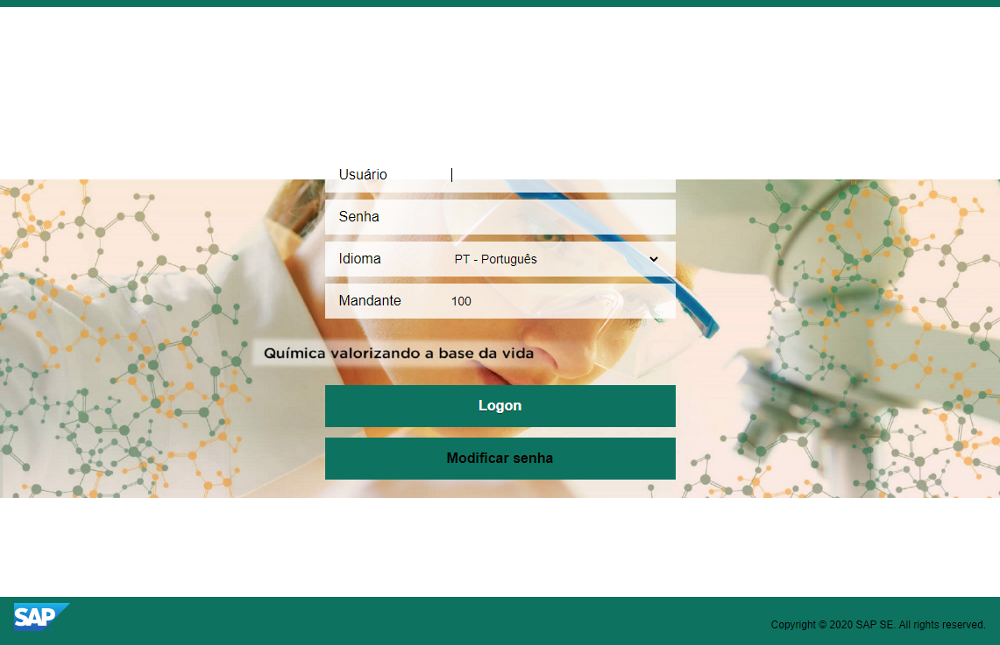
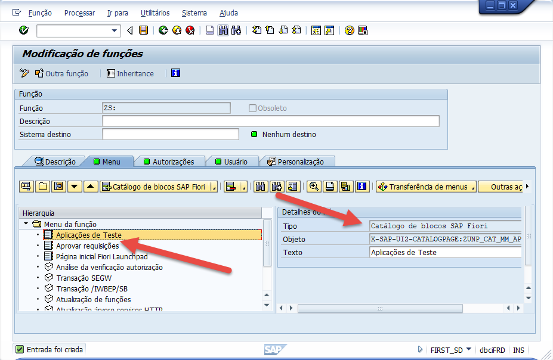

# AppTeste para deploy no SAP Gateway

Aplicação de Exemplo para deploy no SAP Gateway

# Deploy App no SAP Gateway
Esse procedimento é para o deploy de uma aplicação SAPui5 no SAP Gateway. Será abordado permissões, componentes instalados e procedimmento de deploy. Não será abordado a criação da aplicação SAPui5, pois seje o procedimento de criação de aplicação na versão que está instalado no ambiente do SAP Gateway.

## Transações e permissões necessárias
Para os devidos acessos serão necessários algumas transações para acesso a funções do SAP Gateway para o Deploy da aplicação SAPui5.

### Transações:
- SE38 - Transação utilizada para a construção de programas e includes.
- SE80 - Transação guarda-chuva das transações de desenvolvimento. Ela agrupa todas as outras transações de desenvolvimento em uma única tela.
- SICF - Verificação e Ativação de Serviços do SAP.
- SU53 - Verifica as permissões do usuário das transações que ele tentou acessar.
- SE10 - Transação utilizada para gerenciar request´s. Nela é possível criar, modificar ou liberar request´s de transporte cópia, workbench ou customizing. Além de permitir a manipulação de tasks.

### Roles / Perfil:
- S_ABAP_ALL - Todas as autorizações para desenvolvedor ABAP ou..
- SAP_BC_DWB_ABAPDEVELOPER - Role de ABAP Developer

#### Fontes:
- https://qametrik.com/transacoes-utilizadas-desenvolvimento-gestao-codigo-z-sap/

## Checar componentes instalados

Para checar os componentes instalados devemos seguir os passos abaixo:

- No menu clique em "Sistema"

  

- No menu clique em "Status"

  

- No dialogo que aparece clique no botão abaixo de "Versão Componente"

  

- No dialogo que aparece verifique os componentes instalados na primeira aba

  

- Na segunda aba certifique-se que os componentes SAP Netweaver e SAP UI Add-on estejam instalados

  

## Checar se o SAPui5 está instalado e verificando a versão
Antes de desenvolver é importante verificar se o SAPui5 está instalado e qual a versão que está instalada para o devido desenvolvimento da aplicação.

Utilize a transação SE80 para verificar o SAPui5. Abrirá a aplicação.

- Clique na opção MINE Repository

  

- Clique na opção PUBLIC

  

- Clique na opção BC

  

- Em seguida abra o caminho: UI5 / LIBRARIES / VER

  

- Na pasta 1.38 (versão do SAPui5, nesse ponto já sabe qual a última versão instalada framework) abra a pasta com.sap.ui5.core / META-INF / resources.

  

- Na pasta procure o arquivo sap-ui-core.js, com isso podemos confirmar o desenvolvimento nessa versão e que o ambiente está preparado para receber uma aplicação SAPui5.

  

## Atualização da aplicação
Para o deploy da aplicação os arquivos do projeto já tem que está concluído e preparado para a versão que irá rodar. No nosso caso 1.38.

- Execute a transação SE38 para executar aplicações ABAP. No campo "Programa" coloque '/UI5/UI5_REPOSITORY_LOAD', em segui clique em 'Executar (F8)'.

  

- Informe o nome da aplicação que será atualizada (nesse caso). No caso de uma nova aplicação deve informar o nome da aplicação, informar a chave do desenvolvedor para o upload. Em seguida clique para executar.

  

- Após clicar em executar aparecerá um dialogo para o upload da pasta onde está a aplicação SAPui5 (webapp). Clique em OK.

  

- Será listado todos os arquivos que serão carregados para a aplicação. Em seguida clique em "Clicar aqui para upload".

  

- Será exibido um dialogo para informar a Ordem de Transporte (Request), no caso de não ter essa request não será transportado para outro ambiente, clique no check para avançar.

  

- Nesse ponto a aplicação já foi carregada completamente para o SAP Gateway e está pronta para ser utilizada.

  

## Verificando a aplicação carregada e executando
Após o carregamento será necessário saber qual o endereço de execução da aplicação carregado no SAP Gateway. Para isso execute a transação SICF para abrir o programa para verificar e ativar componentes no Gateway.

- Ao abrir o programa mantenha no campo "Categoria de hierarquia" com o o valor "SERVICE" e clique em Executar (F8).

  

- Será exibido a lista de serviços disponiveis no ambiente. Vá na estrutura de pastas e expanda a pasta sap / bc.

  

- Na pasta sap / bc procure a pasta ui5_ui5 / sap, onde estão as aplicações carregadas.

  

- Encontrada a aplicação carregada. Você pode clicar duas vezes na aplicação para abrir e ver os detalhes do serviço ou clicar com o botão direito para testar o serviço.

  

- Clicando duas vezes poderá verificar o caminho que a aplicação será utilizada e o nome do serviço.

  

- Clicando com o botão direito será exibido um menu, nesse menu selecione a opção "Testar serviço".

  

- Pode aparecer um dialogo pedindo permissão para execução do serviço. Nesse ponto já pode verificar o endereço que será executado para o serviço da aplicação carregada.

  

- Agora poderá ver a aplicação sendo executada no endereço.

  

## Utilizando Fiori Client
Será necessário acessar o Fiori Client tanto no navegador quando no dispositivo movel.

- URL: http://host:port/sap/bc/ui5_ui5/ui2/ushell/shells/abap/FioriLaunchpad.html#Shell-home

## Acessando no Navegador

- Login de acesso ao Fiori

  

- Pagina de Home do Fiori

  

## Acessando no Fiori Client
No Firoi Client será visualizado exatamente e mesma coisa no navegador, com a diferença de acessar a aprtir do Cliente Fiori.

- Baixe o Fiori Client da loja (Play Store / Apple Store);
- Instalar o Fiori Client;
- Configurar a URL de acesso ao Fiori;
- Configurar chave de verificação do Fiori Client de seu dispositivo;

## Acessando Fiori LauchingPad Designer
Para a aplicação carregada será necessário inclui um um catalogo e em um grupo no Fiori LauchingPad.
- URL: http://host:port/sap/bc/ui5_ui5/sap/arsrvc_upb_admn/main.html#/Catalog/X-SAP-UI2-CATALOGPAGE:/UI2/FLP_ADMIN

  

## Permissões para acesso a aplicação carregada
Uma aplicação para ser exibida tem que ser adicionada a um Catalogo. Esse catalogo por sua vez deve se associado a um role para os usuários que iram acessar a aplicação carregada no SAP Fiori do Gateway.

## Adicionando App no Fiori LauchingPad

No caso da do cliente em questão, que tem uma customização do Fiori, existe uma transação exclusiva para acessar as funções utilizadas pelo LauchingPad.

Transação: LPD_CUST

- Funções do Lauchingpad

  

- Defina o nome da função, instancia e descrição que será utiliada para acionar a aplicação. Clique na ação confirmar.

  

- Após confirmar será exibido a nova função. Dê um duplo clique na linha da função para abri-la e configurar.

  

- Clique na ação 'Aplicação Nova', será incluido uma linha no nivel da pasta 'App Teste' qu foi o nome da função criada. Em seguida, informe o 'Link Text' o caminhão da aplicação carregada no SAP Gateway anteriormente. Clique na ação de 'back' que irá solicitar para salvar a função.

  

- Agora vá para o Fiori LauchingPag, parar adicionar um Catalogo. E clique na ação de adicionar.

URL: http://host:port/sap/bc/ui5_ui5/sap/arsrvc_upb_admn/main.html?sap-client=100&sap-language=PT

  

- Informe o Título e o ID do catalogo e clique na ação 'Gravar'.

  

- Será exibido o catalogo criado e agora clique para adicionar uma aplicação na aba 'Bloco'.

  

- Selecione a opção solicitada, no nosso casoque não teremos indicadores dinâmicos, selecionaremos 'App laucher - estático'.

  

- Informe o título, sbutitulo, palavra-chave, objeto semântico e ação da aplicação. Em seguida clique na ação 'Gravar'.

  

- A instância do app já foi criada, agora clique na aba 'Atribuições'.

  

- Clique na ação 'Criar Atribuição de destino'. Iremos definir a função que está sendo utilizada para abrir a aplicação.

  

- Informe o objeto semântico, ação, selecione o tipo de aplicação (no caso customizada LPD_CUST), o nome da função criada anteriormente e o alias da aplicação. Em seguida clique na ação 'Gravar'.

  

- A aplicação ainda não poderá ser adicionar no LauchingPad do usuário, pois é necessário dar a permissão do catalogo para a role criada para o usuário acessar a aplicação. Poderá associar a uma role já existente ou criar uma nova role. Para adicionar o catalogo criado a uma role, voltaremos para o SAP GUI.

- Execute a transação PFCG. Informe o nome da função, nesse caso o nome da role atribuida ao usuário usuário que iremos adicionar o catalogo.

  

- Ao abrir, vá na aba 'Menu' e clique na ação para adicionar um obejto na hierarquia, aparecerá um menu e selecione a opção 'Catálogo de Blocos SAP Fiori'.

  

- Aparecerá um dialogo e informe o ID do catalogo. Caso não se lembre clique na ação do lado do campo para abrir um dialogo para seleção do catalógo.

  

- Selecione o catalógo clicando duas vezes.

  

- Clique na ação para confirmar a inclusão do objeto na hierárquia.

  

- Agora pode verificar que o catalogo está adicionado nas funções da role.

  

- Volte para o Fiori LauchingPad para adicionar a aplicação. Clique para adicionar uma aplicação.

  

- Será exibido os catalogos das aplicações que a role tem acesso, basta clica na ação em baixo do tile desejado que será adicionado no LauchingPad.

  

- Aplicação adicionada no grupo aparecerá no toastmessage a confirmação.

  

- Pronto!! Sua aplicação está pronta para ser utilizada.

  

##### Fontes:
- <a href='https://blogs.sap.com/2017/11/19/sap-fiori-ui5-application-deployment/'>Deploy a Fiori app in SAP Fiori</a>
- <a href='https://www.tutorialspoint.com/sap_fiori/index.html'>SAP Fiori Tutorial</a>
- <a href='https://answers.sap.com/questions/11224058/correct-source-path-for-ui5-resources-at-netweaver.html'>Correct source path for UI5 resources at netweaver</a>
- <a href='https://help.sap.com/doc/2e65ad9a26c84878b1413009f8ac07c3/201909.000/en-US/config_guide_system_backend_abap_development_tools.pdf'>Configuring the ABAP Back-end for ABAP Development Tools</a>
- <a href='https://help.sap.com/saphelp_smp3012sdkmfadev/helpdata/en/68/96e3c45d4f41b182389afeec8c1cca/content.htm?loaded_from_frameset=true'>Configuring SAP Fiori Client Using URL Query Parameters</a>
- <a href='https://help.sap.com/saphelp_hba/helpdata/en/0a/a5665239086d2de10000000a44176d/frameset.htm'>Setup of Catalogs, Groups, and Roles in the SAP Fiori Launchpad</a>
- <a href='https://help.sap.com/saphelp_uiaddon10/helpdata/en/2d/98610a5bcf43dfad588e755459dc42/frameset.htm'>Launching the Launchpad Designer</a>
- <a href='https://blogs.sap.com/2015/10/20/list-of-useful-sap-fiori-tcodes/'>List of Useful SAP Fiori TCodes</a>
- <a href='https://blogs.sap.com/2015/07/09/sap-fiori-ll20-role-and-authorization-settings-for-sap-fiori-launchpad/'>SAP Fiori LL20 – Role and Authorization settings for SAP Fiori launchpad</a>
- <a href='https://sapyard.com/configuring-sap-gui-transaction-in-fiori-launchpad/'>Configuring SAP GUI Transaction in Fiori Launchpad</a>
- <a href='https://help.sap.com/viewer/f3e3a9ffe47f4c039ebd1546747288f2/7.52/en-US/fa9344533d2e6757e10000000a44538d.html'>Creating PFCG Role on Front End and Assigning Launchpad Catalogs and Groups</a>
- <a href='https://help.sap.com/saphelp_uiaddon20/helpdata/en/1f/b206d06c074c068edf1418cf301899/content.htm?no_cache=true'>Atribuir catálogos de blocos a funções</a>
- <a href='https://help.sap.com/saphelp_uiaddon20/helpdata/en/1f/b206d06c074c068edf1418cf301899/frameset.htm'>Assign Tile Catalogs to Roles</a>
- <a href='https://help.sap.com/saphelp_hba/helpdata/en/38/3e8f546185ed57e10000000a423f68/content.htm?loaded_from_frameset=true'>Setup of Roles</a>
